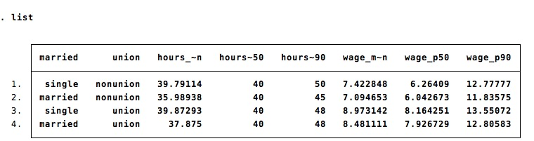

### `sumup` prints summary statistics by group

By default, `sumup` returns the same set of statistics than `summarize` 

```
sumup wage, by(race) 
```


With the option `detail`, `sumup` returns detailed statistics:
```
sumup wage, by(industry) detail
```


### `sumup` is flexible

The option `statistics` allows to specify a set of statistics:
```
sysuse nlsw88.dta, clear
sumup wage, by(industry) statistics(mean p80)
```


The list of allowed statistics is the following:

Name | Definition
---|---
mean          | mean
count         | count of nonmissing observations
n             | same as count
missing	|	Number of missing observations
sum           | sum
max           | maximum
min           | minimum
range         | range = max - min
sd            | standard deviation
variance      | variance
cv            | coefficient of variation (sd/mean)
semean        | standard error of mean (sd/sqrt(n))
skewness      | skewness
kurtosis      | kurtosis
median        | median (same as p50)
iqr           | interquartile range = p75 - p25
q             | equivalent to specifying p25 p50 p75
p??			|	any ??th percentile


### `sumup` accepts groups defined by several variables:

`sumup` can compute summary statistics for groups defined by multiple variables:

```
sumup wage, by(union married) 
```


This makes `sumup` a useful extension of `tabulate`:

```
sumup, by(union married) 
```


### `sumup` can `collapse` to an external dataset
You can write the result in an external dataset by using the `output` option:
```
sumup hours wage, by(union married) statistics(mean p50 p90) output(temp.dta)
describe using temp.dta
```


The output file is written using the command `postfile`. For now, it does not include value labels and variable labels.

### `sumup` is fast
`sumup` is ten times faster than `table, contents()`; `tabstat` or `collapse`. `sumup` is as fast, but more flexible, than `tabulate, summarize()`.

# fasttabstat
`sumup` borrows heavily from `tabstat`. The command `fasttabstat` is a drop-in version of `tabstat`, with two advantages:
- `fasttabstat`  is 10x faster than `tabstat`.
- `fasttabstat` accepts more statistics than `tabstat` : 
	- any percentile 
	- `missing` : number of missing observations.


# Installation
```
net install sumup , from(https://github.com/matthieugomez/stata-sumup/raw/master/)
```
