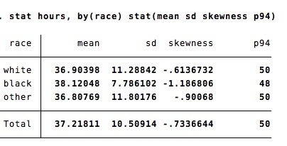

# Stata-stat

The command `stat` is a faster version of `tabstat` (or `tab, summarize()`, `table`, `collapse`etc).

# Syntax 
The syntax is

```
stat varname, by(varname) stat(mean sd skewness p94)
```

By default, the command computes the same statistics than `summary`

```
sysuse nlsw88.dta, clear
stat varname, by(varname) 
```


```
sysuse nlsw88.dta, clear
stat varname, by(varname) stat(mean sd skewness p94)
```



# List of allowed statistics

The list of allowed statistics is:

||
mean          | mean
count         | count of nonmissing observations
n             | same as count
sum           | sum
max           | maximum
min           | minimum
range         | range = max - min
sd            | standard deviation
variance      | variance
cv            | coefficient of variation (sd/mean)
semean        | standard error of mean (sd/sqrt(n))
skewness      | skewness
kurtosis      | kurtosis
p??				??th percentile
median        | median (same as p50)
iqr           | interquartile range = p75 - p25
q             | equivalent to specifying p25 p50 p75
detaild			| count mean min max sd skewness kurtosis p1 p5 p10 p25 p50 p75 p90 p95 - p99 max

