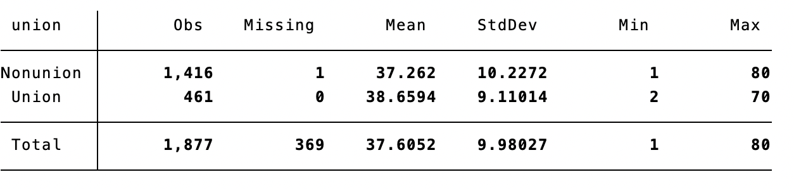
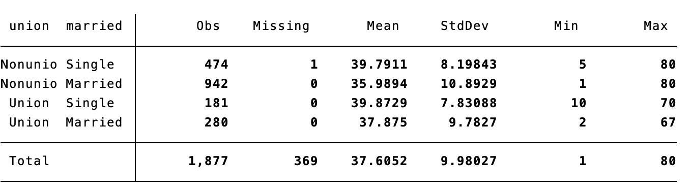
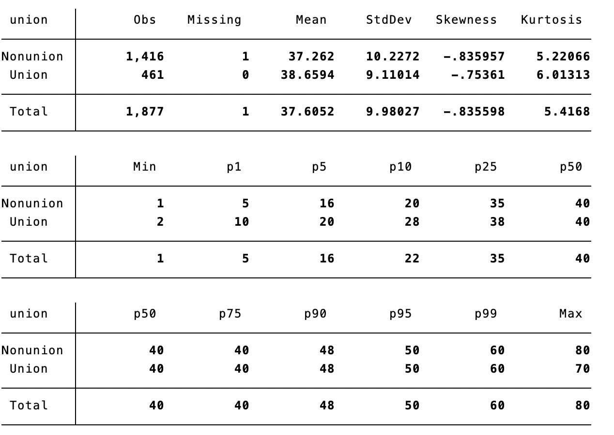

### `sumup`  = `summarize` by group

`sumup` allows to `summarize` your data by groups defined by one or more variable

```
sysuse nlsw88.dta, clear
sumup hours, by(race) 
```


```
sumup hours, by(union married) 
```


- Use the detailed option to return detailed statistics
```
sumup hours, by(industry) detail
```


- Use the `statistics` option to return a specific set of statistics (including any percentile)

	```sumup hours, by(industry) statistics(p80)```


`sumup` is ten times faster than `table, contents()` or `tabstat`. Another difference is that the result returned by `sumup` can be saved as a dataset with the option `replace` or `save(...)`.
 


# Installation
`sumup` is now available on SSC. 

```
ssc install sumup
```

To install the latest version  on Github 
- with Stata13+
	```
	net install sumup, from("https://raw.githubusercontent.com/matthieugomez/sumup/master/")
	```

- with Stata 12 or older, download the zipfiles of the repositories and run in Stata the following commands:
	```
	net install sumup, from("SomeFolder")
	```
