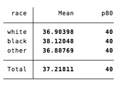
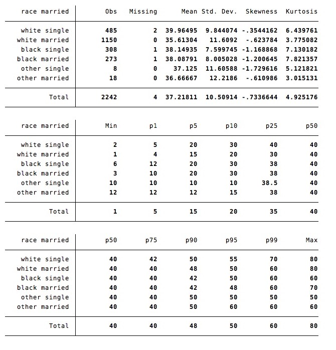
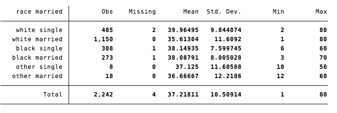
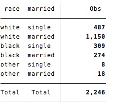
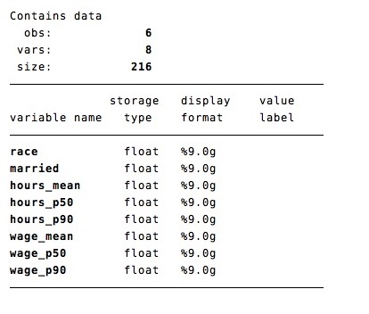

The command `sumup` prints summary statistics by groups. 


### `sumup` prints statistics by group

```
sysuse nlsw88.dta, clear
sumup hours, by(race)  statistics(mean p80)
```



### `sumup` extends `summarize`:

By default, `sumup` returns the same set of statistics than `summarize` 

```
sumup hours, by(race) 
```


The option `detail` returns detailed statistics:
```
sumup hours, by(race) detail
```



### `sumup` accepts an arbitrary number of statistics

The list of allowed statistics is:

Name | Definition
---|---
mean          | mean
count         | count of nonmissing observations
n             | same as count
sum           | sum
max           | maximum
min           | minimum
range         | range = max - min
sd            | standard deviation
variance      | variance
cv            | coefficient of variation (sd/mean)
semean        | standard error of mean (sd/sqrt(n))
skewness      | skewness
kurtosis      | kurtosis
median        | median (same as p50)
iqr           | interquartile range = p75 - p25
q             | equivalent to specifying p25 p50 p75
missing	|	Number of missing observations
p??			|	any ??th percentile


### `sumup` accepts groups defined by several variables:

You can compute summary statistics within groups defined by multiple variables:

```
sumup hours, by(race married) 
```



This makes `sumup` an extension of `tabulate` for groups defined by multiple variables
```
sumup, by(race married) 
```



### `sumup` can `collapse` to an external dataset
Use the `output` option:
```
sumup hours wage , by(race married) s(mean p50 p90) output(temp.dta)
describe using temp.dta
```


### `sumup` is fast
`sumup` is faster than `tabulate, sum()` ; `table, contents()`; `tabstat` or `collapse`


# fasttabstat

The command `fasttabstat` is a drop-in version of `tabstat`, with two advantages:
- `fasttabstat`  is 10x faster than `tabstat`.
- `fasttabstat` accepts more statistics than `tabstat` : 
	- any percentile 
	- `missing` : number of missing observations.

