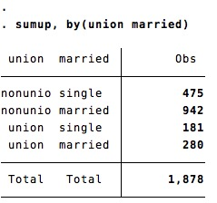
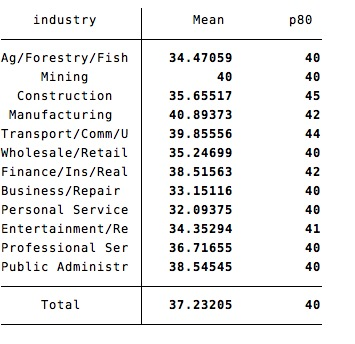
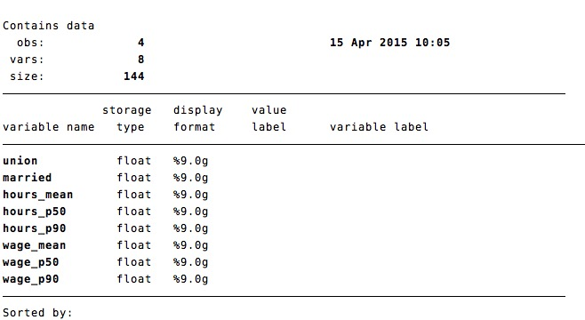

### `sumup`  = `summarize` by group

`sumup` returns the same set of statistics than `summarize`, but computes them by group

```
sysuse nlsw88.dta, clear
sumup hours, by(race) 
```


With the option `detail`, `sumup` returns detailed statistics:
```
sumup hours, by(industry) detail
```


### `sumup` accepts groups defined by several variables:

Compute summary statistics for groups defined by multiple variables:

```
sumup hours, by(union married) 
```


Count the number of observations by groups defined by multiple variables:

```
sumup, by(union married) 
```



### `sumup` is flexible

Specify any set of statistics using the option `statistics`
```
sumup hours, by(industry) statistics(mean p80)
```



The list of allowed statistics is the following:

Name | Definition
---|---
mean          | mean
count         | count of nonmissing observations
n             | same as count
missing	|	Number of missing observations
sum           | sum
max           | maximum
min           | minimum
range         | range = max - min
sd            | standard deviation
variance      | variance
cv            | coefficient of variation (sd/mean)
semean        | standard error of mean (sd/sqrt(n))
skewness      | skewness
kurtosis      | kurtosis
median        | median (same as p50)
iqr           | interquartile range = p75 - p25
q             | equivalent to specifying p25 p50 p75
p??			|	any ??th percentile


### `sumup` can `collapse` to an external dataset

Save the summary statistics  dataset through the `save` option:

```
sumup hours wage, by(union married) statistics(mean p50 p90) save(temp.dta) replace
```

collapse


### `sumup` is fast
`sumup` is ten times faster than `table, contents()`, `tabstat` or `collapse`. `sumup` is as fast, but more flexible, than `tabulate, summarize()`.


# Installation
`sumup` is now available on SSC. 

```
ssc install sumup
```

To install the latest version  on Github 
- with Stata13+
	```
	net install sumup, from(https://github.com/matthieugomez/stata-sumup/raw/master/)
	```

- with Stata 12 or older, download the zipfiles of the repositories and run in Stata the following commands:
	```
	net install sumup, from("SomeFolder")
	```

# Reference
`sumup` borrows heavily  from `tabstat`.  The package also includes the command `fasttabstat` which is a drop in faster version of `tabstat`.