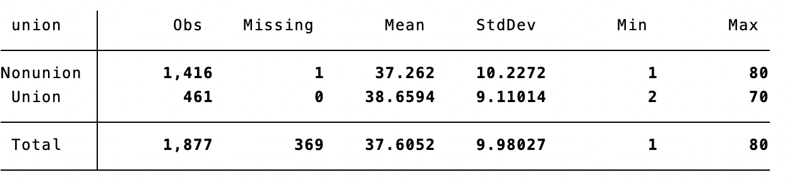
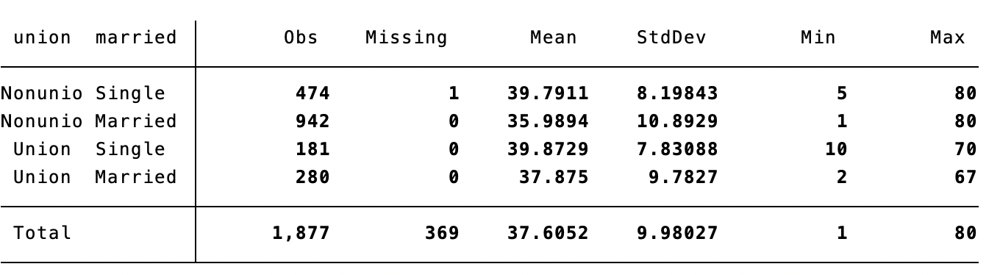
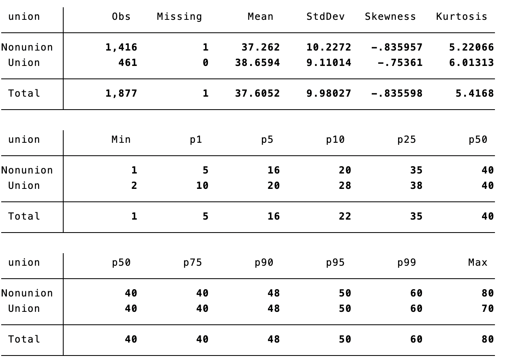
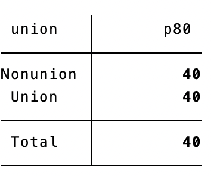

### `sumup`  = `summarize` by group

`sumup` allows to `summarize` your data by groups defined by one or more variable

```
sysuse nlsw88.dta, clear
sumup hours, by(union) 
```

- Use multiple group variables

```
sumup hours, by(union married) 
```


- Use the detailed option to return detailed statistics

```
sumup hours, by(union) detail
```


- Use the `statistics` option to return a specific set of statistics (including any percentile)

```
sumup hours, by(union) statistics(p80)
```


- Use the `replace` or `save(...)` options to save the output table as a dataset


`sumup` is ten times faster than other programs with similar functionalities (e.g. `table, contents()` or `tabstat`).
 


# Installation
`sumup` is now available on SSC. 

```
ssc install sumup
```

To install the latest version from Github 
```
net install sumup, from("https://raw.githubusercontent.com/matthieugomez/sumup/master/")
```
